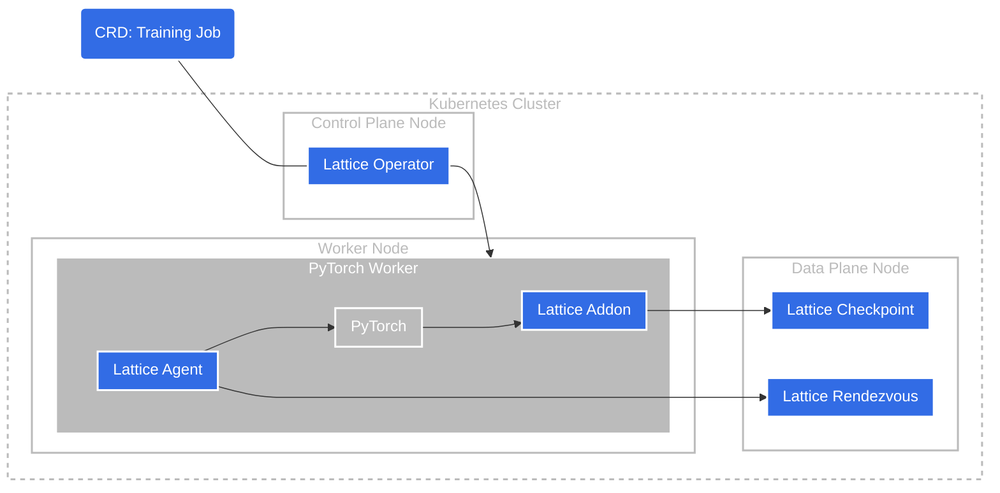

# Overview

## Lattice

"Lattice" is a Kubernetes-based full-stack machine learning system developed by BreezeML. It is based on the concept of **"elastic training"**, which means that the system can automatically scale up and down the number of workers to meet the workload demand. It also provides fault tolerance and high availability by automatically restarting the failed workers. Different from other elastic machine learning systems, Lattice is designed to be fully transparent to the users. We achieve this goal by introducing a few low-level system patches to the machine learning frameworks, maintaining the most recent states of the training jobs with checkpoints.

### System Architecture

The following diagram shows the architecture of Lattice:



It consists of the following components:

- **Lattice Operator**: A Kubernetes operator that watches the Training Job CRD and manages the training job. You can interact with the Lattice Operator by creating, updating, and deleting the Training Job CRD, which will trigger the Lattice Operator to create, update, and delete the distributed training jobs.
- **Lattice Agent**: A background process that launch the training process and manage its lifecycle. It is responsible for monitoring the training process, and taking actions such as restarting the training process when it fails.
- **Lattice Addon**: A python package helps automatically manage the object states and checkpoints Python objects of machine learning frameworks. It helps to save and resume the training progress when failure or other events happen.
- **Lattice Rendezvous**: A service that provides in-memory key-value store as a communication channel between the Lattice Agents.
- **Lattice Checkpoint**: A service that provides persistent storage for checkpoints used by the Lattice Addon.

### User Interface

To get started, you can create a distributed training job by creating a Training Job CR. The following is a YAML file that defines a distributed training job with minimal 1 worker and maximum 3 workers, which means that the system will automatically scale up the number of workers to 3 when the workload demand is high, and scale down the number of workers to 1 when the workload demand is low.

```yaml
apiVersion: "breezeml.ai/v1"
kind: TrainingJob
metadata:
  name: example-job
  namespace: lattice
spec:
  minSize: 1
  maxSize: 3
  replicaSpecs:
    template:
      spec:
        containers:
          - name: trainingjob
            image: breezeml/lattice-resnet
            imagePullPolicy: Always
            command: ["python", "-u", "main.py"]
```

Save the YAML file as `example-job.yaml`, and then run the following command to create the training job:

```bash
kubectl apply -f example-job.yaml
```

You can check the status of the training job by running the following command:

```bash
kubectl get trainingjob example-job -n lattice
```

For more information, refer to the [Lattice Operator Guidance](/docs/ref/operator).
