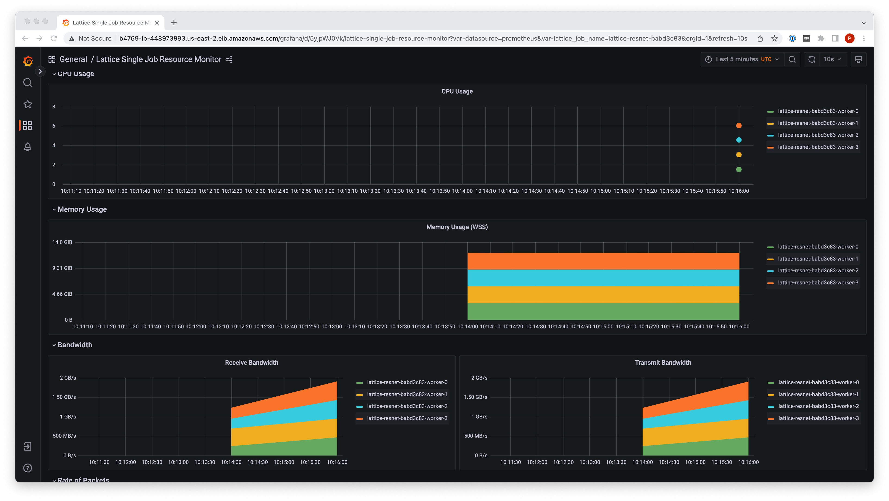
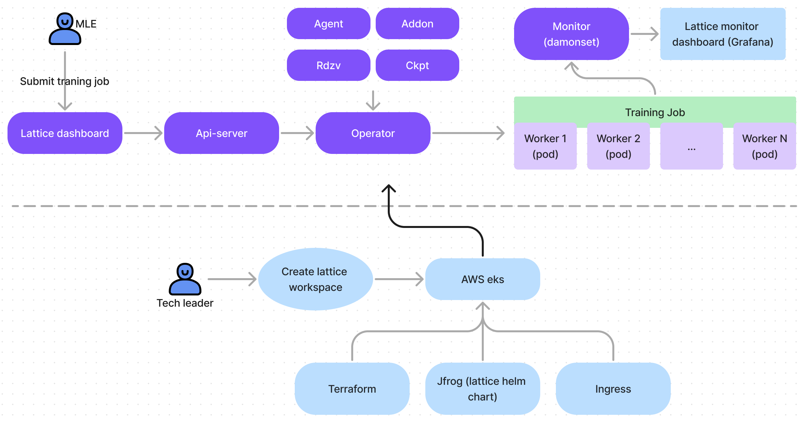

# Lattice Monitor & Logging

## :eye: Lattice Monitor

:wave::wave::wave: [Detailed Introduction] and [ChangeLog] are in the [[Design and Changelog.md]](https://breezeml.atlassian.net/wiki/spaces/SD/pages/11862070/Changelog+Lattice+Monitor) 

| Web frontend |   Workflow     |
|:------------:|:--------------:|
|  |     |

### :point_right: Quick Start

Run the following command, you will get a 

- EKS cluster
- AWS load balancer controller
- prometheus / kube-metric / lattice grafana dashboard


```bash
cd terraform/aws_eks

terraform init
terraform plan
terraform apply

```

### :sunny: Quick Test
```bash
aws eks update-kubeconfig --name lattice_dashboard_ingress_v1 --region ap-southeast-1

kubectl get pods -n lattice-monitor

kubectl -n monitoring port-forward svc/prometheus-operated 9090
kubectl -n monitoring port-forward svc/grafana 3000
```

### :bellhop_bell: Helm Chart 

Install on you own cluster

go to [[lattice-monitor helm chart]](./helm/lattice-monitor/README.md)

### :handshake: Contributing

```bash
# edit sys_monitor_deploy/kube-prometheus-stack/charts/grafana/values.yaml
dashboardsConfigMaps:
  default: "grafana-dashboards"

# create sys_monitor_deploy/kube-prometheus-stack/charts/grafana/templates/grafana-dashboard-configmap.yaml

# remove admin password
# sys_monitor_deploy/kube-prometheus-stack/charts/grafana/values.yaml
auth.anonymous:
    enabled: true
```

## :balloon: Lattice Logging

### Path 1: filebeat + elasticsearch + kibana

- [x] add volume by eks csi
- [x] test filbeat for logging collection
- [x] test elasticsearch for logging persistent
- [x] test kibana

#### Install filebeat/logstash/elasticsearch/kibana
```bash
cd model_log_deploy
helm install filebeat ./filebeat -n model-logging --create-namespace
helm install elasticsearch ./elasticsearch -n model-logging --create-namespace
helm install kibana ./kibana -n model-logging --create-namespace
```

#### Get login credentials
```bash
kubectl get secrets --namespace=model-logging elasticsearch-master-credentials -ojsonpath='{.data.password}' | base64 -d

kubectl get secrets --namespace=model-logging elasticsearch-master-credentials -ojsonpath='{.data.username}' | base64 -d
```


### Path 2: promtail + loki + grafana
- [ ] WIP